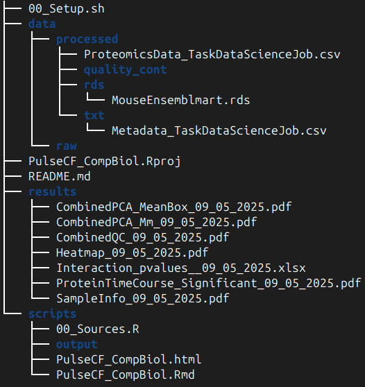

# PulseCF_CompBiol

Here's the layout of the main folders and files in this project:

{ width=50% }

## 00_Setup.sh
Automates project initialization by creating the directory structure (data/, scripts/, results/, etc.) and downloading any required baseline files.

## PulseCF_CompBiol.Rmd
A self-contained analysis report that walks through the entire proteomics pipeline:

1. **Library loading & theme definitions**  
   - Sources `00_Sources.R` to load R packages (tidyverse, lme4, emmeans, biomaRt, etc.)  
   - Defines color palettes and ggplot themes for consistency across figures

2. **sample metadata exploration**  
   - Reads and tidies the sample metadata
   - Plots sample counts by day and treatment (Figure 1)

3. **Quality-control plots**  
   - Imports log2-transformed proteomics data  
   - Generates boxplots and density plots faceted by mouse and day to verify distributional assumptions (Figure 2)

4. **Principal Component Analysis**  
   - Performs PCA on the scaled protein matrix  
   - Visualizes PC1 vs. PC2 and PC3 vs. PC4 overall and faceted by day to assess main sources of variation and treatment separation (Figures 3 & 4)

5. **Mean protein expression**  
   - Calculates mean log2 expression per protein, per group, per day  
   - Draws paired boxplots with connecting lines to highlight group differences at each time point (Figure 4)

6. **Statistical modeling & differential proteins**  
   - Loops over each protein to fit a linear mixed-effects model (`log2 ~ Group * Day + (1 | Mouse:Joint)`)  
   - Extracts `groupxday` interaction p-values, applies FDR correction, and annotates significant proteins  
   - Saves a "key" sheet and the full results to an Excel workbook for downstream review

7. **Time-course plots for significant proteins**  
   - Subsets to the proteins with FDR < 0.05  
   - Plots each protein's trajectory—raw points, mean ± SE ribbons, and trend lines—across days 0, 7, 14, and 49 (Figure 5)

8. **Pairwise contrasts & heatmap**  
   - Uses `emmeans` to compute control vs. treatment contrasts at each day for the 14 significant proteins  
   - Builds a heatmap of log2 fold-differences with significance asterisks to pinpoint when effects occur (Figure 6)

9. **Session information**  
   - Captures R version and all loaded package versions in a neat table, ensuring full reproducibility